# TarPay 💳

> *"Paise bhejo, darr nahi"*

TarPay is a DeFi-inspired UPI escrow engine for Bharat. Every payment goes through a smart safety hold — wrong payment? Cancel instantly. Dispute? Funds frozen until resolved.

**Built for HACK HUSTLE 2.0 — FinTech Track | Saveetha Engineering College, Chennai**

---

## Screenshots

| Welcome | Home | Send Payment |
|---|---|---|
| 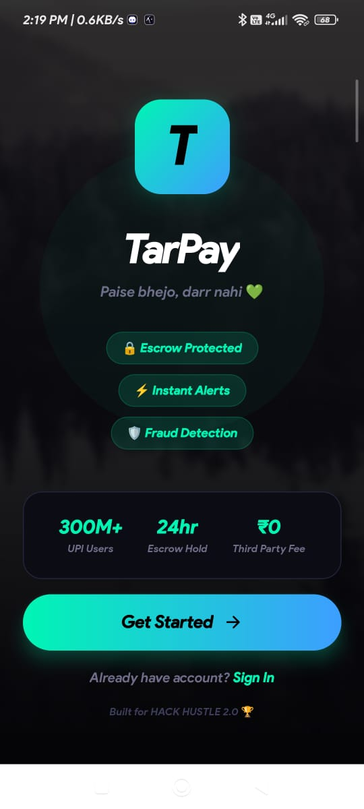 | 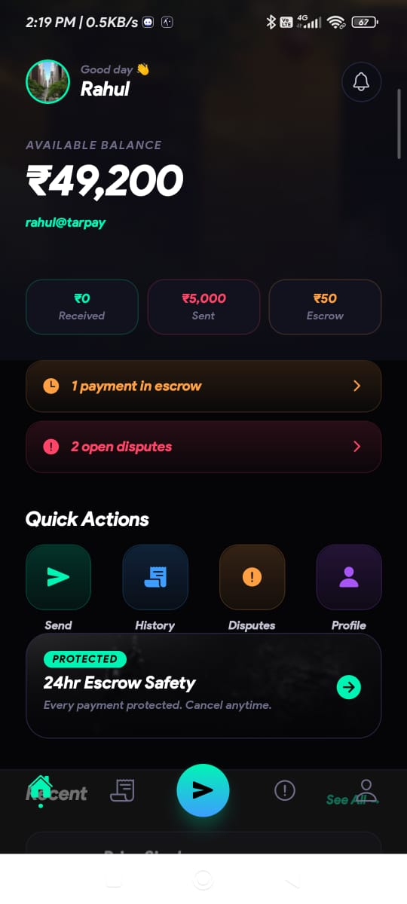 | 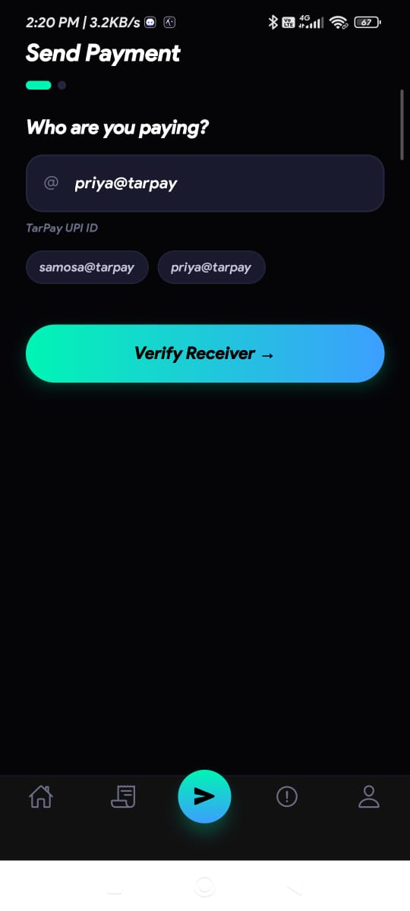 |

| Escrow Hold | Send Step 2 | Send Step 3 |
|---|---|---|
| 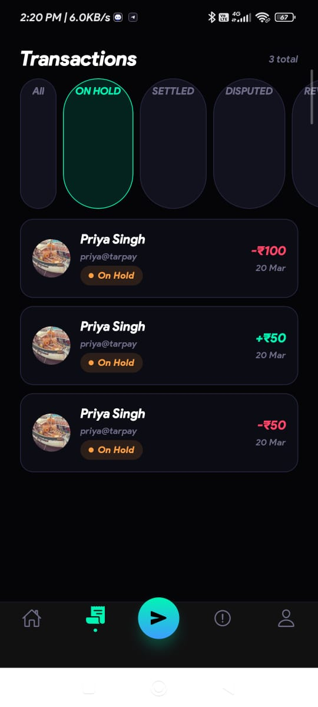 | 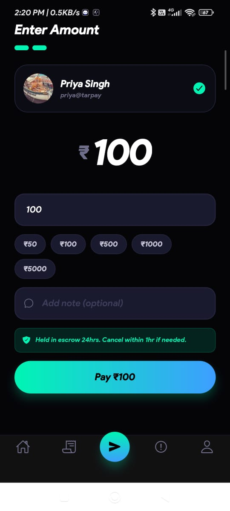 | 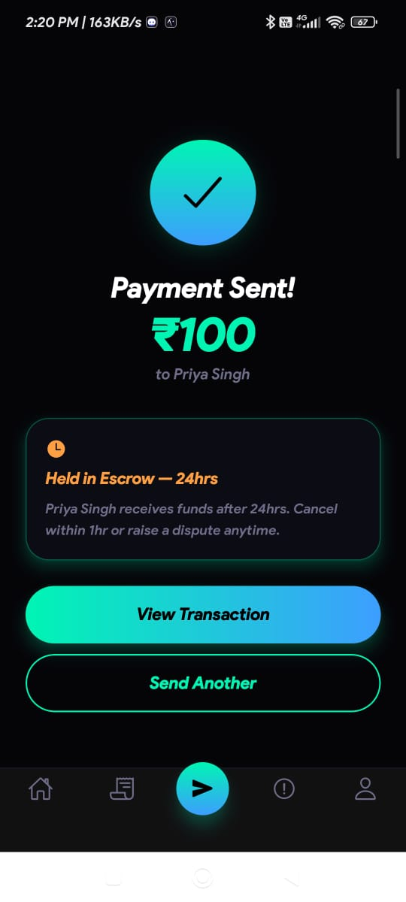 |

| Transaction Detail | All Transactions | Settled |
|---|---|---|
| 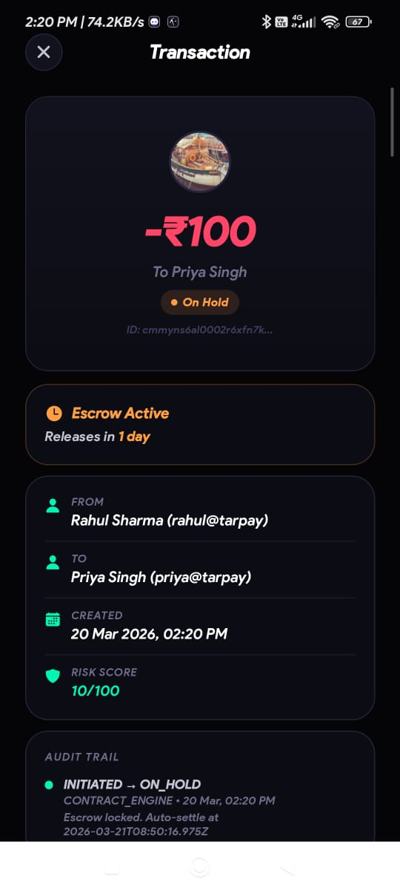 |  | 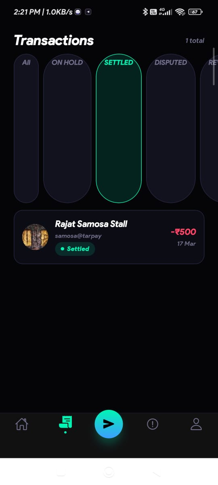 |

| Disputed | My Disputes | Reverted |
|---|---|---|
| 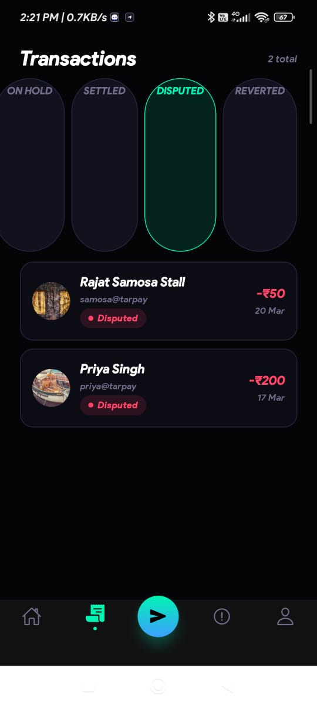 | 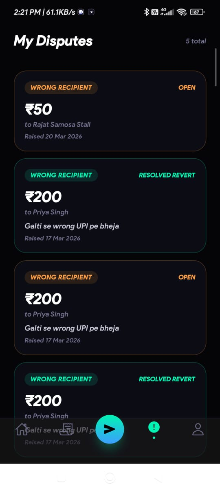 | 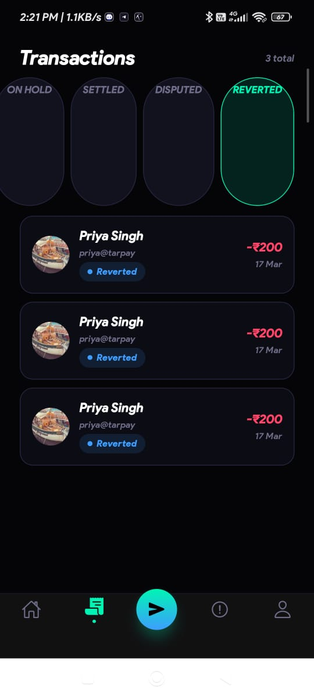 |

| Profile | Notifications |
|---|---|
| 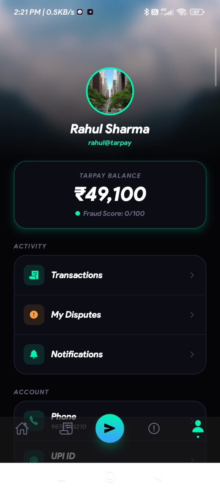 | 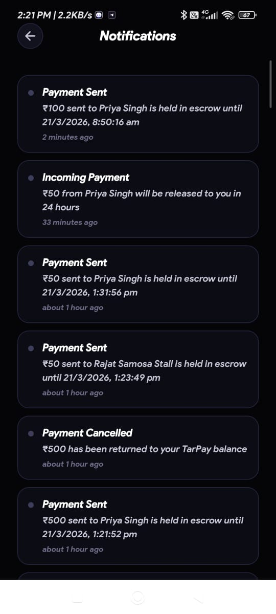 |
 Download the app  Now Avalible for android Device 

---

## Monorepo Structure

```
tarpay/
├── contract/
│   └── src/engine.js          ← TarPay Contract Engine (the brain)
├── backend/
│   ├── prisma/schema.prisma   ← Full DB schema
│   └── src/
│       ├── index.js           ← Server entry point + cron
│       ├── middleware/auth.js
│       └── routes/
│           ├── auth.js
│           ├── transactions.js
│           ├── disputes.js
│           ├── users.js
│           └── admin.js
├── mobile/                    ← Expo React Native App (SDK 54)
│   ├── app/
│   │   ├── index.jsx          ← Welcome screen
│   │   ├── (auth)/            ← Login + Register
│   │   ├── (tabs)/            ← Home, Send, History, Disputes, Profile
│   │   ├── tx/[id].jsx        ← Transaction detail + audit log
│   │   ├── dispute/[id].jsx   ← Raise dispute
│   │   └── notifs.jsx         ← Notifications
│   ├── components/            ← GBtn, Card, Pill, Input, TxRow
│   ├── store/auth.js          ← Zustand auth state
│   └── services/api.js        ← Axios API layer
└── tests/
    ├── TarPay.postman_collection.json
    └── run.js                 ← Automated test runner (30 tests)
```

---

## Quick Start — Backend

```bash
cd backend
npm install
cp .env.example .env
# Fill in DATABASE_URL (Neon PostgreSQL) and JWT_SECRET

npx prisma migrate dev --name init
npx prisma generate
node src/utils/seed.js
npm run dev
# → http://localhost:4000
```

## Quick Start — Mobile App

```bash
cd mobile
npm install --legacy-peer-deps
cp .env.example .env
# EXPO_PUBLIC_API_URL=http://YOUR_LAN_IP:4000

npx expo start --clear
# Scan QR with Expo Go (SDK 54)
```

---

## Demo Accounts

| UPI ID | Password | Role | Balance |
|---|---|---|---|
| rahul@tarpay | password123 | Consumer | ₹50,000 |
| priya@tarpay | password123 | Consumer | ₹25,000 |
| samosa@tarpay | password123 | Merchant | ₹5,000 |
| fraud@tarpay | password123 | High Risk (Score: 80) | ₹1,000 |

---

## Smart Hold Duration

TarPay automatically adjusts escrow hold time based on trust level:

| User Type | Hold Duration | How |
|---|---|---|
| Normal user | **24 hours** | Default for all new payments |
| Verified merchant | **1 hour** | `isMerchant: true` in account |
| Trusted contact | **10 minutes** | Prior settled transactions exist |
| Repeat same UPI | **Instant** | Multiple settled txns with same receiver |

> Powered by the Contract Engine's `assessRisk()` + `holdDuration` field in Prisma schema.

---

## How Escrow Works

```
User pays →
  ✅ Validate receiver (registered? fraud score?)
  ✅ Assess risk (0-100 score)
  🔒 Funds locked in escrow vault
  ⏱️  Smart hold timer starts
       ↓
  No action → Auto-settle after hold period ✅
  Within 1hr → Sender can cancel → Instant refund ✅
  Dispute raised → Escrow frozen → Admin resolves ✅
  Fraud detected → Auto-flagged → Manual review ✅
```

---

## API Reference

| Method | Endpoint | Auth | Description |
|---|---|---|---|
| POST | /api/auth/register | ❌ | Create account |
| POST | /api/auth/login | ❌ | Login → JWT |
| GET | /api/transactions/validate/:upiId | ✅ | Pre-payment fraud check |
| POST | /api/transactions/send | ✅ | Send (escrow hold) |
| POST | /api/transactions/:id/cancel | ✅ | Cancel (1hr window) |
| GET | /api/transactions/history | ✅ | Paginated tx history |
| GET | /api/transactions/:id | ✅ | Tx detail + audit log |
| POST | /api/disputes/raise | ✅ | Raise dispute |
| GET | /api/disputes/my | ✅ | My disputes |
| GET | /api/users/me | ✅ | Profile + balance |
| GET | /api/users/dashboard | ✅ | Analytics + stats |
| GET | /api/users/notifications | ✅ | In-app notifications |
| POST | /api/admin/disputes/:id/resolve | 🔐 | Resolve dispute (REVERT/SETTLE) |
| GET | /api/admin/disputes | 🔐 | All open disputes |
| GET | /api/admin/flagged | 🔐 | Flagged transactions |
| POST | /api/admin/settle | 🔐 | Manual auto-settle trigger |
| GET | /health | ❌ | Health check |

---

## The Contract Engine

`contract/src/engine.js` — TarPay's core. DeFi-inspired rule engine on our own infrastructure.

| Function | What it does |
|---|---|
| `validateReceiver` | Check UPI ID before money moves |
| `assessRisk` | Score 0-100 fraud risk per transaction |
| `initiateTransaction` | Lock funds in escrow atomically |
| `cancelTransaction` | 1-hour hard cancel window |
| `raiseDispute` | Freeze escrow, open investigation |
| `resolveDispute` | Admin settles or reverts with audit log |
| `autoSettle` | Cron every 5min: release after hold period |

---

## Test Suite

```bash
# Automated test runner
cd backend
node tests/run.js

# Or Postman
# Import: tests/TarPay.postman_collection.json
# Run collection → 30 requests with assertions
```

---

## Tech Stack

| Layer | Technology |
|---|---|
| Contract Engine | Node.js (custom rule engine) |
| Backend | Express.js |
| ORM | Prisma |
| Database | PostgreSQL (Neon) |
| Auth | JWT + bcrypt |
| Scheduler | node-cron (auto-settle every 5min) |
| Mobile | Expo React Native SDK 54 |
| State Management | Zustand |
| Navigation | Expo Router (file-based) |

---

## Why TarPay?

> *"Every payment app made payments faster. We made them safer."*

**The Problem:**
- 300M+ UPI users in India
- Wrong payments happen daily — no instant undo
- Bank disputes take 7-10 business days
- Small merchants pay 2-3% fees to Razorpay/Stripe
- No pre-validation before money moves

**The Solution:**
- Smart escrow hold (24hr → 1hr → 10min → instant based on trust)
- Pre-flight receiver validation with fraud scoring
- 1-hour cancel window — instant refund, no bank involved
- Dispute system that freezes funds immediately
- Zero fees for merchants

---

## Roadmap (Post Hackathon)

- [ ] Real NPCI/UPI integration (RBI sandbox)
- [ ] AI-powered fraud scoring
- [ ] Merchant SDK for e-commerce
- [ ] Open Banking API for loan applications

---

*Built with ❤️ for HACK HUSTLE 2.0 — FinTech Track*
*"Paise bhejo, darr nahi" 💚*